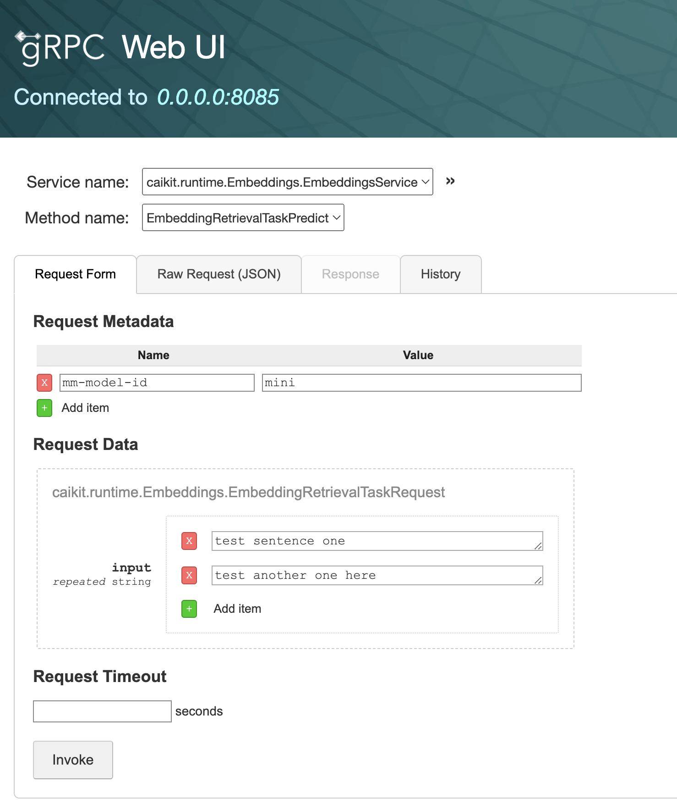

# Caikit Embeddings

Caikit service for embeddings.

## Example models

This repo includes a `models` directory which configures 2 model instances for testing.

| Model ID | Use case                               |
|----------|----------------------------------------|
| mini       | Example for embedding retreival module |
| mini-ss    | Example for sentence similarity module |

## Try it out

The repository contains an example configuration to use the sentence-transformers/all-MiniLM-L6-v2 model from huggingface. The model will be downloaded and cached locally.

### Before Starting

The following tools are required:

- [python](https://www.python.org) (v3.8+)
- [pip](https://pypi.org/project/pip/) (v23.0+)

**Note:** Before installing dependencies and to avoid conflicts in your environment, it is advisable to use a virtual environment. The subsection which follows provides an example of a virtual environment, Python venv.

#### Setting Up Virtual Environment using Python venv

For [(venv)](https://docs.python.org/3/library/venv.html), make sure you are in an activated `venv` when running `python` in the example commands that follow. Use `deactivate` if you want to exit the `venv`.

Install the dependencies: `pip install -r requirements.txt`

```shell
python3 -m venv venv
source venv/bin/activate
pip install -r requirements.txt
```

### Starting the Caikit Runtime

In one terminal, start the runtime server:

```shell
source venv/bin/activate
cd demo/server
python3 start_runtime.py
```

### Embedding retrieval client

In another terminal, run the client code to retrieve embeddings.

```shell
source venv/bin/activate
cd demo/client
python3 infer_model.py
```

The client code calls the model and queries for embeddings using 2 example sentences (hardcoded in infer_model.py).

You should see output similar to the following:

```ShellSession
$ python3 infer_model.py
INPUTS:  ['test first sentence', 'another test sentence']
RESULTS: [
   [0.02021969109773636, 0.07058270275592804, 0.008317082189023495, ...]
   [0.04209445044398308, 0.07522737234830856, 0.018512120470404625, ...]
]
LENGTH:  2  x  384
```

### Sentence similarity client

In another terminal, run the client code to infer sentence similarity.

```shell
source venv/bin/activate
cd demo/client
python3 sentence_similarity.py
```

The client code calls the model and queries sentence similarity using 1 source sentence and 2 other sentences (hardcoded in sentence_similarity.py). The result produces the cosine similarity score by comparing the source sentence with each of the other sentences.

You should see output similar to the following:

```ShellSession
$ python3 sentence_similarity.py   
SOURCE SENTENCE:  first sentence
SENTENCES:  ['test first sentence', 'another test sentence']
RESULTS:  [0.6898421049118042, 0.5583217144012451]
```

### Try the REST API using the FastAPI GUI

The server is configured to serve a REST API UI with a FastAPI UI at: http://0.0.0.0:8080/docs (running locally).

* Follow the link: http://0.0.0.0:8080/docs
* Click on the `POST` to expand it
* Click on the `Try it out` button to test it
* Enter `mini` as the **model_id**
* Click the `Execute` button

You can edit the **Request body** as shown below to test with multiple input sentences.


Scroll down to see:

* the resulting **Response body**
* how to run the request with curl
* additional API documentation

### Try grpcui

The server is configured to support gRPC with reflection. This is used by the infer_model.py client above. If you'd like to explore with the `grpcui` client, follow these steps:

1. Install grpcui
2. Run `grpcui -plaintext 0.0.0.0:8085`
3. Select the **Service name** and **Method name** as shown below
4. Under **Request Metadata** set **Name** to `mm-model-id` and **Value** to `mini`
5. Under **Request Data** click on `Add item` one or more times to add input sentences
6. Click the `Invoke` button

The request form will look like this:



After you hit `Invoke`, it will show the response like this:


Use the **Request Form** or **History** tab to try another request or retry a recent one.